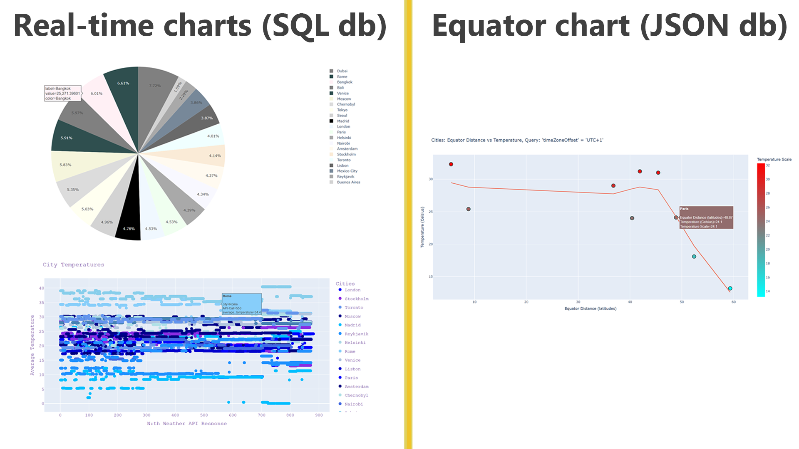
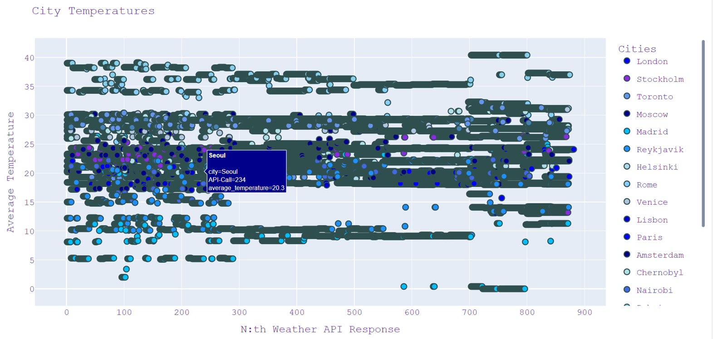
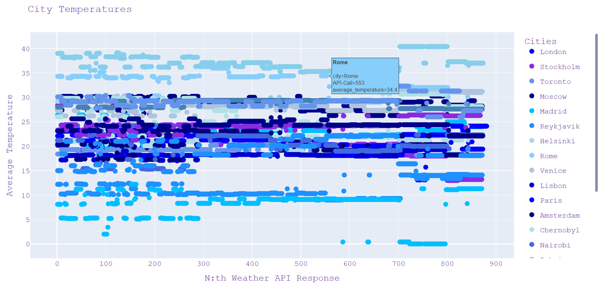
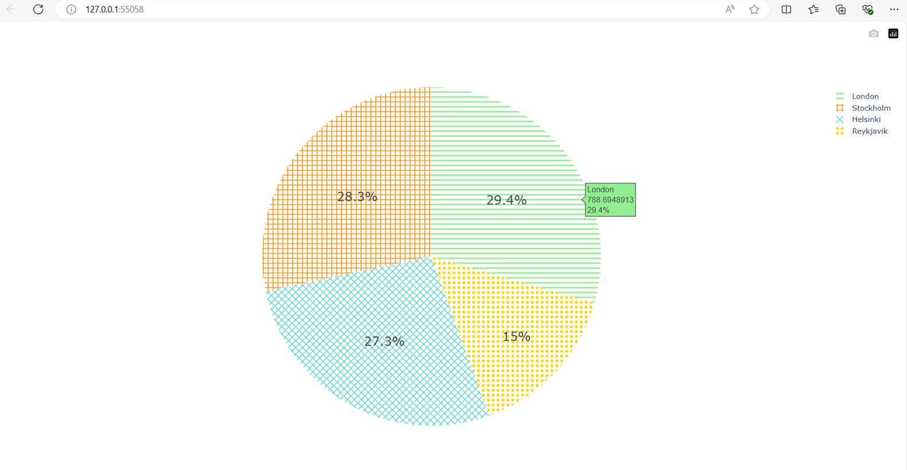
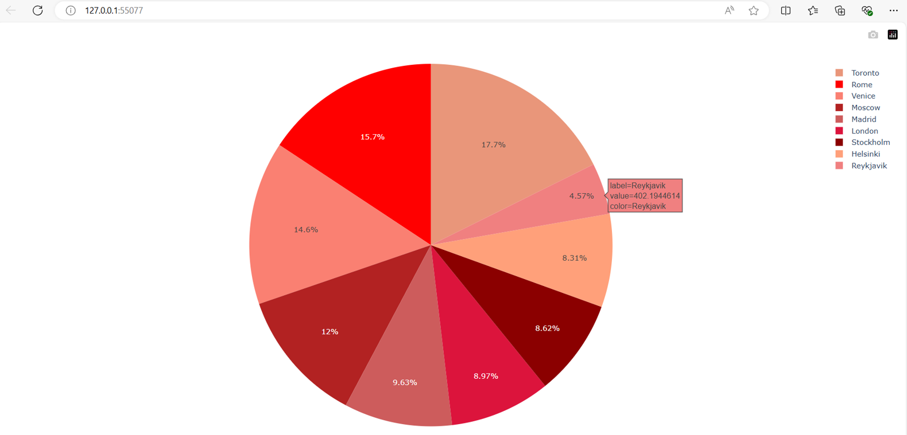
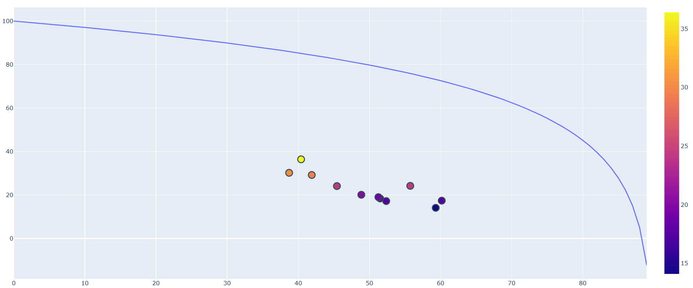
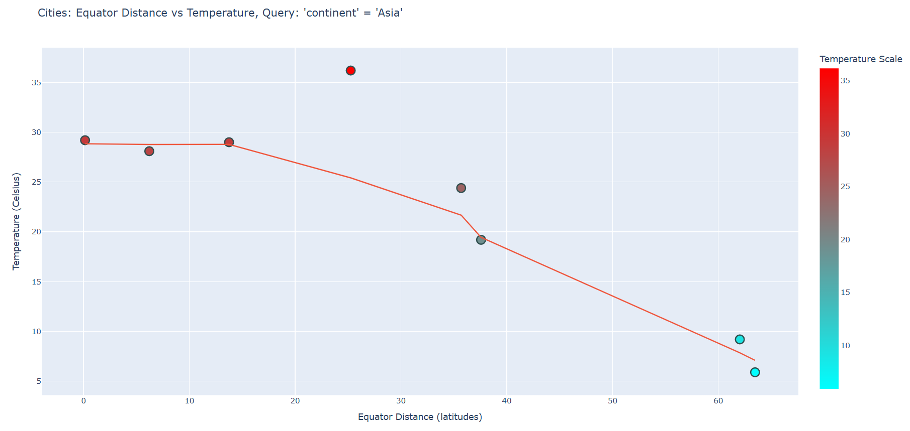
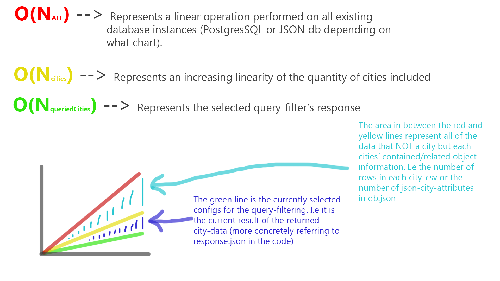
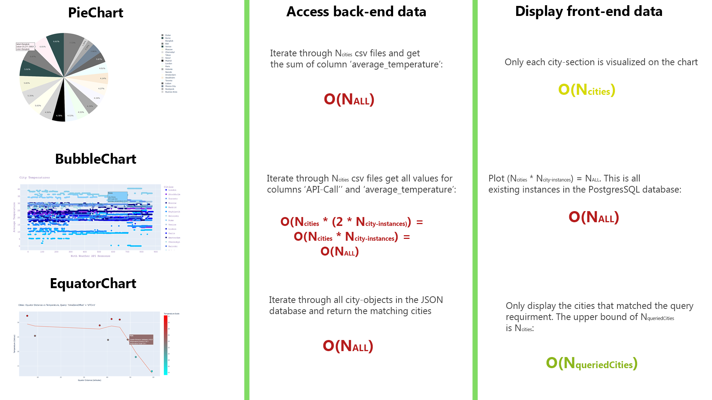
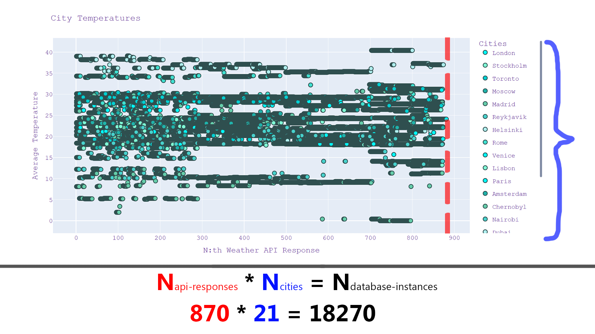

# 🌎 Global City Streaming

> Real-time global temperature analysis through modern streaming architecture


[](https://kafka.apache.org/)
[](https://flink.apache.org/)
[](https://www.postgresql.org/)
[](https://www.docker.com/)
[](https://www.python.org/)


- FastAPI, React, Nextjs, Typescript, Confluentinc, Bitnami


## 📑 Table of Contents
- [🌎 Global City Streaming](#-global-city-streaming)
  - [📑 Table of Contents](#-table-of-contents)
  - [🔍 Project Overview](#-project-overview)
  - [🌡 Equator Distance Temperature Hypothesis](#-equator-distance-temperature-hypothesis)
  - [🚀 Get Started](#-get-started)
    - [Instructions \& Executions](#instructions--executions)
      - [3. Container Debugging](#3-container-debugging)
      - [4. Data Visualization](#4-data-visualization)
      - [5. Combinatorial Automations](#5-combinatorial-automations)
    - [Start/Stop application](#startstop-application)
  - [🏗 Architecture](#-architecture)
    - [Developer Entrypoints - Debug API for Developers](#developer-entrypoints---debug-api-for-developers)
    - [Real-time Data Streaming \& Processing](#real-time-data-streaming--processing)
    - [Debugging Output - Backend functionality](#debugging-output---backend-functionality)
    - [Configurations](#configurations)
      - [Configuration Variables](#configuration-variables)
      - [APIs](#apis)
        - [Weather API](#weather-api)
        - [Geolocation API](#geolocation-api)
        - [Math Curve API](#math-curve-api)
        - [Color API](#color-api)
      - [API Tests](#api-tests)
  - [🌎 Global Feature](#-global-feature)
  - [📊 Charts](#-charts)
    - [Bubble Chart](#bubble-chart)
    - [Pie Chart](#pie-chart)
      - [Randomized Colors](#randomized-colors)
      - [4 Coldest Cities](#4-coldest-cities)
      - [Color Theme](#color-theme)
    - [Equator Chart](#equator-chart)
      - [Equator Chart Data Flow](#equator-chart-data-flow)
      - [Equator Chart - Conceptual idea to Implementation](#equator-chart---conceptual-idea-to-implementation)
    - [Equator Maths](#equator-maths)
      - [Experimentation Phase](#experimentation-phase)
      - [Paper Sketches](#paper-sketches)
      - [Final adjustments](#final-adjustments)
    - [Equator Solution](#equator-solution)
  - [🎁 Bonus Features](#-bonus-features)
    - [Docker Volumes Persistence](#docker-volumes-persistence)
    - [Complexities Analysis](#complexities-analysis)
  - [📚 Learning Lessons](#-learning-lessons)
  - [🔮 Future Updates](#-future-updates)

## 🔍 Project Overview

In the summer of 2024, I decided to pursue practical knowledge of Big Data and data pipelines. This project was developed in an intensive 2-week-sprint (18th June to 2nd July), and it analyzes the temperatures of a group of cities anywhere in the world. The application is divided into 3 parts:

**Kafka Producer:** Produces the current temperature of each of the defined cities. This data is sent to the Flink processor as a batch, and this operation is executed each `X:th` second, where X is the number defined in the Kafka-docker-container.

**Flink Processor:** This module receives the produced data each `X:th` second, and for each `Y:th` second, where `Y` is the number defined in the Flink-docker-container, all of the generated instances are aggregated. In the context of this project, the aggregation is to look at each city's reported temperatures and calculate the corresponding average temperature obtained throughout these `Y` seconds.

**PostgreSQL:** Lastly, the aggregated batch is stored in the database. Note that each batch is inserted within an interval of `Y` seconds. Hence, `X` is the sample duration of each city's temperature, and `Y` is the allowed seconds for the periodic samples to take place before they are reset and inserted to the database. Thus, we get the following mathematical relations that always hold true:
- **X <= Y**   -->   If `Y` is greater than `X` no samples are retrieved and null is inserted in PostgreSQL
- **N = Y/X**    -->   The number of samples retrieved during one batch, or in other words, the number of samples that a database instance is founded upon. The bigger `N` is, the more consistency of the db-instance value can be expected

**IMPORTANT NOTE:** Throughout this project, as a result of the architecture, the *PieCharts* and *BubbleCharts* are referred to as `Real-time charts`, and *EquatorCharts* are denoted as `Equator charts`. Due to the extended branch of the architecture that was necessary to integrate the 'EquatorCharts', I found it important to make this distinction in terminology to avoid confusion. The 'Real-Time charts' got their name because of their remarkable characteristic of being tied to the generating data pipeline in `/application` that is predicated on the Big Data and real-time producing and processing technologies (Kafka, Flink, PostgreSQL).

## 🌡 Equator Distance Temperature Hypothesis

Throughout the development process of the project, further ideas emerged and I eventually developed a hypothesis that I ended up proving with my data in this project. In the data analysis of temperatures across cities around the globe, I started questioning the validity of the equator's relation to a city's temperature:

- *The closer to the equator a city is, the higher the average temperature is*

Clearly, there is some truth to this statement. Spain is generally hotter than Sweden, Russia is colder than Italy and Dubai is hotter than France, just to name a few. Moreover, is this relation strictly linear? Or are there exceptions? Perhaps a few countries are outliers due to external environmental factors? If so, to what degree? With all of these questions on my mind, I formulated the following comprehensive question:

- *What is the numerical relation between a geographical area's altitude and the equator?*

- Since the equator is at altitude 0, and the total altitude ranges from -90 to 90, I figured that taking the absolute value would represent a city's direct distance to the equator. Thus, making a city's distance to the equator the X-value in the line graph.

- At the time I finished this project I had **20,000+ db instances** in the PostgreSQL database. However, due to the extensive capacities of the technologies used in this project (Kafka, Flink and Docker), this project is able to store way more instances without decreasing in performance.

## 🚀 Get Started

In many of my prior projects I always found the process of starting and setting up the system tedious and repetitive. That's why I aimed to counteract that productivity-killing and time-consuming aspect in this project, and I used Bash scripting to solve this. Shell scripting is a powerful tool for automating tasks and simplifying the management of systems and applications. In this project, I aspired to simplify it to the point so that all you need to do is to run the docker containers, which will automatically execute the contained scripts in each subdirectory. In other words, encapsulating the functionality and permissions to avoid confusion.

### Instructions & Executions

In the `/instructions-executions` directory, a detailed get-started guide is provided. Its content is divided in two subfolders:

- **Descriptive:** Only concerned with instructional PDF files, detailing the process of familiarizing and setting up the system for the developer

- **Executionary:** Is primarily concerned with shell scripts, and offers a few SQL files to provide examples of possible interactions with PostgreSQL

It is worth noting that this entire process is automated. Each **i:th** PDF in `Descriptive` subdirectory is based on each **i:th** file in `Executionary` subdirectory. Below are a few showcases of how the **i:th** instruction collective is supposed to look like in action:

#### 3. Container Debugging

1.  
2.  
3.  
4.  
5. 

#### 4. Data Visualization

1.  
2.  
3. 

#### 5. Combinatorial Automations

The main script, `instructions-executions/executionary/5. combinatorial-automations.sh`, invokes other refactored Bash modules. It collaborates with the general `utils.sh` to redirect the dataflow into each distinct chart: `bubbleChart-combinations.sh`, `pieChart-combinations.sh` and `equator-combinations.sh`

1.  
2.  
3. 

Automation - For each continent, run a query and plot the data:

4. 

Automation - For each color provided by [Color API](#color-api), plot a piechart of the data:

5. 

### Start/Stop application

Once all dependencies are solved, there are two scripts that you need to be aware of:

- `start.sh` is the executionary for a new compilation of the updated code and runs the system. The developer has the options to exclude any of the following functions if he only wants to compile a certain module: Flink & Maven docker image and Kafka Producer docker image

- `stop.sh` is the executionary for ceasing the activity of the docker containers. It's up to the developer on which of the 2 functions inside of this shell script that is enabled. By default, the function to stop the application and save the stored PostgreSQL instances is enabled. Furthermore, if the developer wishes to remove all instances in conjunction with the termination of the application, then he has to manually change it in this file. This mode is useful when working with BigData where a vast amount of datapoints are turning the database into a mess, or when you want to override all instances with to-be produced ones in the next execution instead of inserting new ones on top of the existing ones.

## 🏗 Architecture

This project involves three main modules. Two of which are directly contributing to the functionality and features of the project, whereas one is solely intended for the ease of developers or maintainers in their endeavors:

**Code Functionality/Feature Modules:**

- *Real-time Data Streaming & Processes* module is described in the [Real-time Data Streaming & Processing](#real-time-data-streaming--processing) section

- *Debugging Output* module is described in the [Debugging Output - Backend functionality](#debugging-output---backend-functionality) section

**Developer Operation Module:**

- *Developer Inquiries & Entrypoints* is supporting automation of regular flows of executions of the system that is needed to generate output or test the system's reliability. This module is described in detail in the [Developer Entrypoints - Debug API for Developers](#developer-entrypoints---debug-api-for-developers) section


### Developer Entrypoints - Debug API for Developers

- Debug API, the interactive endpoint for developers to debug the system by providing commands and retrieving the outputs and artifacts


`4. data-visualization.sh` is a central automation script


Why `4. data-visualization.sh` is important:

- You, as the developer or maintainer, has the responsibility of analyzing the data from different aspects, to make data-driven decisions. These aspects, in the context of his project, are to apply filters on the data (query parameters), whether to display certain metrics and to define the output format. To do so, you must adhere to the laid out architecture that I had in mind in the development of this project. At the moment, the act of debugging is divided in two categories, with respect to the sub-components' dependencies and dataflow (which will be further explained later in this README file)

Since I invested a lot of time in developing this Debug API, its architecture and data flows were dramatically altered. My goal was always to make this API as automated as possible, to the point where the interacting developer only has to specify a high-level option and everything else is taken care of chained shell-scripts:


Although the architecture displayed in the picture above satisfies all my initial objectives, I didn't feel done with this task yet. As I was debugging the project I always ended up in repetitive tasks of executing the sub-automated tasks of `4. data-visualization.sh`. Hence, I opted for automating this process as well. However, it wasn't as simple as I had anticipated for, as it soon was apparent that a multitude of sub-shell-modules were needed to maintain the modularity and sustainability of the code. As a project expands, the harder it gets to reverse changes, and therefore it's crucial that the code is sustainable in the sense that variable-changes and passed attributes are synced across the entire system, for every conceivable combination. Finally, I extended my previous architecture to the one below:


### Real-time Data Streaming & Processing

Once all containers are up and running, they are creating a repetitive cycle of events and operations:

1. Connect to PostgreSQL database

2. Kafka periodically produces data with even and predefined intervals

3. Flink processor receives data and aggregates it to specified format

4. The database instances are stored in the database


### Debugging Output - Backend functionality

This is the `Debugging Output` module with the backend `.py` scripts for charts and APIs that is located in `/debug-api`. This is where 3 things happen in sequence:

1. In `/charts`, the shell scripts invoke `main.py` with parameters that direct the dataflow to the specific chart script. This script then sends requests to the scripts in `/apis`.

2. The `/apis` scripts send the corresponding response to the client-script in `/charts`.

3. The `.png` and `.csv` files representative of the system's execution are generated in `/generated-artifacts`. Note that the `.csv` files are only stored to facilitate and demonstrate the ease of a potential extension of the system's architecture, since it highlights the possibility of storing vast amounts of distinguishable data in a formatted way. As for the `.png` files, they constitute the visualized [Charts](#charts) in a static non-interactable format to provide a quick overview of the status and implications of the data.


### Configurations

This section is solely concerned the file `configuration.yml` and its significance it brings to the developers. Below, all of the variables are debunked. For simplicity, I replaced the actual values with uppercase variables in the `configuration.yml` structure to firstly convey their abstract context of usage, and then present the possible values for each variable:

```yaml
debugApi:
  citiesPool:
  - {CITY_NAME_1}
  - {CITY_NAME_N}
  queryConfig:
    queryAttribute: {QUERY_ATTRIBUTE}
    queryRequirement: {QUERY_REQUIREMENT}
  charts:
    bubbleChart:
      separateGraphDisplay: {BOOLEAN}
      colorTheme: {COLOR_THEME}
      pngOutput: {BOOLEAN}
    pieChart:
      chartType: {CHART_TYPE}
      colorTheme: {COLOR_THEME}
      pngOutput: {BOOLEAN}
    equatorChart:
      displayLinearTrend: {BOOLEAN}
      displayLogarithmicTrend: {BOOLEAN}
      displayActualTrend: {BOOLEAN}
      pngOutput: {BOOLEAN}
```

#### Configuration Variables

- **CITY_NAME_X:** The name of the city you wish to plot on the EquatorChart. Examples of possible values are 'London', 'Buenos Aires', 'Venice' and 'Tokyo'

- **QUERY_ATTRIBUTE:** The name of the attribute of a city-object to query. For reference, all of the current city-objects are stored in "/debug-api/apis/database/db.json". As for now, two of these attributes are supported in "/debug-api/apis/queryApi.py". In other words, the only possible values for this variable is 'continent' and 'timeZoneOffset'. Note that if you don't want to query anything, meaning that you want to work with the entire database, then specify 'none'

- **QUERY_REQUIREMENT:** The required value of the the query attribute that must be matched. This variable serves as a filter such that only city-objects whose attribute ($QUERY_ATTRIBUTE = $QUERY_REQUIREMENT) are returned in "/debug-api/apis/database/response.json". The possible values for this variable is directly linked to the value you inputted for $QUERY_ATTRIBUTE. If you are querying by 'continent', then potential values are 'Europe', 'Africa', 'America' and 'Asia'. If you are querying by 'timeZoneOffset', then potential values are 'UTC+0', 'UTC+1', 'UTC+2', ..., 'UTC-5', 'UTC-6'. Lastly, if you are querying by 'none', the value of this field doesn't matter

- **COLOR_THEME:** The color palette of related RGB colors that are all derived from the inputted main color. The input is processed by "/debug-api/apis/colorApi.py" that interacts with a public api that makes this possible. A few possible values for this attribute are 'green', 'purple', 'yellow', 'blue', 'red', 'orange', 'gray', 'aqua', 'pink' and 'brown'. Note that in the structure above, this variable is used twice. This was just to simplify the conceptual explanation. Hence, there is no dependency between the 'colorTheme' of the 'pieChart' and 'bubbleChart', such that you can set the name color for both of them or assign distinct colors

- **BOOLEAN:** Represents the range of a regular boolean with 'True' or 'False'. Note that 'equatorChart.displayLinearTrend' and 'equatorChart.displayActualTrend' can't be True at the same time, by virtue Plotly's constraints for only holding the capacity of displaying one general trend at a time of a provided dataset. However, in "/debug-api/charts/equatorChart.py" I check for this erroneous input and set the default case to be treated as if only 'equatorChart.displayActualTrend' was set to True.

- **CHART_TYPE:** The type of 'pieChart' to display. I implemented three different types that deviate from one another primarily in the regard of appearance. Possible values for this attribute are 'Random-Colors', '4-Coldest-Cities' and 'Color-Theme'. As the first type implies, a piechart with randomized colors for each city-section is generated. Pertaining to the second type, it excludes all cities but the four that obtains the coldest temperature. In cases where the developer has inputted less than or equal to 4 cities for $CITY_NAME_X in 'debugApi.citiesPool', then 100% of the cities are included in the final output chart. Lastly, the 'Color-Theme' type is inspired by $COLOR_THEME and therefore uses "/debug-api/apis/colorApi.py" to create a color palette around the central color $COLOR_THEME. A noteworthy disclaimer is that unless $CHART_TYPE is set to 'Color-Theme', 'debugApi.pieChart.colorTheme' is negligible.

#### APIs

The first time I was introduced to APIs and started working with them was in a [Bookster](https://github.com/mrjex/Bookster) course in 2023

##### Weather API

I decided to connect an API that fetches weather-data in a geographical area. For this, I used a public API. Visit their [Website](https://www.weatherapi.com/login.aspx) for more information

##### Geolocation API

**Development Process Background:** As new ideas sparked during the development process and I started working on the [EquatorChart](#equator-chart). This feature ended up being a pivotal change because the architectural changes were more significant that I could initially anticipate for. For instance, as I worked on the equator features, I realized that the data will be misleading unless the cities are queried by timezones. Unfortunately [Weather API](#weather-api) didn't include this in its response body. I also thought the idea of querying by continents was a cool feature, so at this point I wanted two more attributes that my initial API wouldn't return. Thus, I figured I integrate a new specialized API for this single responsibility to maintain the modularity. I researched heavily but couldn't find a free public API providing both a continent and a timezone, making me implementing two distinct ones under the common denotation `Geolocation API`. This design pattern that involves two sub-components as a general composition to enhance modularity, encapsulation and readability is something I learned in a [Software Design Patterns](https://github.com/mrjex/Software-Design-Patterns) course, which I then applied in my [Burndown Chart Feature](https://github.com/Indomet/WioPlay/tree/main/seeed-wio-terminal/WioPlay) in the [WioPlay](https://github.com/Indomet/WioPlay/tree/main) project.

**Structure:** This API is a composition of two public APIs ([Continent API](https://timeapi.io/swagger/index.html) and [TimeZone API](https://www.geotimezone.com/)) and returns a merged JSON body

**Response:** The two retrieved datapoints are ultimately merged into one JSON response body. In the example below, we assume that the [TimeZone API](https://www.geotimezone.com/) returned `UTC+1` and the [Continent API](https://timeapi.io/swagger/index.html) returned `Europe`

```json
{
    "timeZoneNotation": "Europe/Stockholm",
    "timeZoneOffset": "UTC+1"
}
```

If you wish to view existing examples stored in the system, navigate to the JSON files located in `debug-api/apis/database`

##### Math Curve API

**Description:** My own API with my mathematical formula with a logarithmic trend. The [EquatorChart](#equator-chart) sends requests to this API, which then are processed by the backend algorithm [Math Curve API Backend](#equator-chart---conceptual-idea-to-implementation) and returns a response

**Response:** It returns a JSON of two attributes, both of which are arrays of 90 elements. The reason why the arrays are of length 90 is because the maximal possible distance from the equator is 90 latitudes, as there are 180 latitudes and the equator is the center.

##### Color API

This is an public [RESTFUL API](https://www.csscolorsapi.com/) that takes a string representing a color as a query and returns the different nuances of it. One notable constraint of this API is that it would only provide 18 nuances of a color. Thus, if the developer had specified more than 18 cities in `configuration.yml`, the corresponding Real-time chart (*bubble chart or pie chart*) wouldn't include all cities. In the face of this problem, I envisioned two solutions:

1. **The Quick & Easy Fix:** Using the modulo operator to wrap the exceeding values to a number in the range of 0-17. The disadvantage with this approach is that the 19th city has the identical color has the 1st city, or more generally expressed:

`i:th city color = (i * 18x)th city color`

2. **The Sophisticated & Maintainable Fix:** This solution is more exciting but time consuming. Assuming each RGB value is of range 0-255, a systematic approach such that it takes the number of cities defined as `N`, and the possible RGB-ranges to evenly distribute the cities' colors to be contrasting each other. The disadvantage I see with this is that if N = 256, then the last city is assigned the same color as the 1st one. However, a more complex model that involves the Alpha-channel and that takes into account the previously applied combinations would drastically increase the number of possible combinations for the colors of the cities without dealing with identical colors.

As I glanced over the purpose of this project and my own objectives of learning, I concluded that the 2nd option, although it's fancier, would distract me from my actual learning goals. Therefore, I opted for the 1st approach to focus more on the architectural and technological aspects of the system.

**Database Postgres API:** Connects to the PostgreSQL database and output data as CSV abd PNG files to `/debug-api/generates-artifacts/*`

**Database JSON API:** Solely dedicated to the equator chart's JSON database storage and operations

#### API Tests

The tests are conducted and automated through shell scripts. I was introduced to this file extension in [Cyber Physical Systems of Systems](https://github.com/mrjex/Cyber-Physical-Systems-and-Sytems-of-Systems) and I appreciated the ease at which the developer can maintain in the development of complex projects with multiple entities, each with their own entrypoint. It's hard to keep track of everything and the order in which sub-components have to be executed to deliver the expected result of one's system. Therefore, I decided to go with these types of tests, as opposed to Postman tests which I worked on in [Bookster](https://github.com/mrjex/Bookster) and [Dentanoid - Distributed Systems](https://github.com/Dentanoid).

**Weather API Tests:**


**Geolocation API Tests:**


**Color API Tests:**


## 🌎 Global Feature


In the beginning of this project, my vision was to only analyze 5 pre-defined cities in Europe. This constraint was then challenged as I plotted the `Real-time charts` using Plotly. When I observed the data I realized I needed a larger quantity and more samples to draw accurate conclusions. In one of my previous projects, [Dentanoid - Distributed Systems](https://github.com/Dentanoid) me and my group of students developing a microservice architecture and had specified requirements for the scalability. I learned that this quality attribute is a significant one, as the usability of your code is correlated with how many users find value in it, and it's hard to value a product that faces performance issues when the workload of customer is higher than anticipated. In that project I made sure that `Dental Clinics` around the world were supported and stored as instances without harming the performance. Similarly, in this project, I saw the need and the potential benefits of implementing this on a global scale. In addition, the configurations of this 'Global Feature' is easily accessible and modifiable for the developer in the central `configuration.yml` file.

## 📊 Charts

All charts are generated as output by the aforementioned [APIs](#apis). There are 3 different charts, each one with its unique ways of highlighting characteristics of data:



### Bubble Chart

Once I made the decision that this project would cover data visualization, I thought a bubble chart was the most effective way of comparing the cities and their deviating temperatures, as it comes with a X and Y axis.


Note that the combinations of all available colors that [Color API](#color-api) provides for this chart is automated, such that bubble charts of all colors are generated all at one command in your browser at [5. Combinatorial Combinations](#5-combinatorial-automations)

*First successful plot with matplotlib:*


Eventually, I switched to *Plotly* because it offers a wider range of UI customization features.

*First Plotly chart:*


I thought the colors looked too random and applied my [Color API](#color-api) and commanded it to return purple-themed colors:


I experimented with the UI further:


Now, towards the end of the project, about 20,000 instances were stored in the *PostgresSQL* database. I set the theme to blue and plotted it:


I quickly realized that the thickness of the outlines, when plotting larger volumes of data, conceals important visual information that the graph reveals. Therefore, I added a variable for their thickness and set it to *0*:


To view more bubble charts, navigate to `/debug-api/generated-artifacts/pngs/bubble-chart`

### Pie Chart

Initially, I only intended to implement one type of pie chart with randomized colors. However, in the process of learning Plotly, I discovered that it was simple to customize the UI and opted for adding a few additional types of pie charts.

#### Randomized Colors


#### 4 Coldest Cities

Displays the proportional difference of the 4 coldest cities with pattern-based colored sections:



#### Color Theme

Capitalizes upon the functionality of [Color API](#color-api) to display a coherent theme of colors in the sections:

*Red Color:*


*Brown Color:*


To view more pie charts, navigate to `/debug-api/generated-artifacts/pngs/pie-chart/*`

### Equator Chart

Once I finished the features above, I had a few ideas in mind that would give me a harder challenge. As I plotted the data in the bubble chart I noticed the general trend of increased temperature combined with decreased distance to the equator. Now, I could have expanded on the SQL database to account for this (adding one more attribute/field 'equatorDistance' to the relational table 'weather'). However, in the pursuit of a challenge that would in turn assist me in familiarizing in the broad topic of programming, I decided to develop a JSON database in the local file system. I've seen the wide usage of JSON and its contributions to software-component communications and viewed this as a good opportunity to gain proficiency in using it.


#### Equator Chart Data Flow

To fully understand the complexity of the equator chart, an insight of the dataflow between the involved entities is necessary. In the picture below, the developer has changed `configuration.yml` to remote the query filter by setting `queryAttribute` to none. Keeping this in mind, all database instances that are retrieved by `cityApi.py` or `databaseJsonApi.py` will be stored in `db.json`. Ultimately, the content of `response.json` is overridden to what the API generated in this most recent execution:


If we expand on the semantics of the picture above, the only thing that changed is that the value of `queryAttribute` is 'Continent' instead of 'none'. With that said, `queryApi.py` or `databaseJsonApi.py` takes the requirement of 'Continent = Europe' and queries the result. And lastly `db.json` and `response.json` stores the result of the query and the chart is visualized:


Conversely, if you change `queryAttribute` to 'timeZoneOffset' you can query cities by timezones:


#### Equator Chart - Conceptual idea to Implementation

This is an extensive feature that required a lot of analysis on my part. The idea of this feature was born out of the quality attribute *Scalability*. At first, I only accounted for 5 pre-defined cities in the world, and realized how inaccurate my conclusions of the data retrieved would be with this insignificant sample. As I extended my system and prepared it for higher loads, the next question that arose was what kind of theories or conclusions I would want to prove, refute or validate. The first thing that came to my mind when observing my previously implemented [Charts](#charts) was how a city's geographical position on Earth affects its temperature. And that's marked the start of my equator-theory venture and articulated my [Equator Distance Temperature Hypothesis](#equator-distance-temperature-hypothesis).


### Equator Maths

The reason for my expectation on a logarithmic trend is founded on one profound argument that I believe is a generality that manifests itself in every conceivable area of life:

- **Theoretical Reasoning:** We always improve in relative to our prior experience. Our speed at learning, the upper limit of how much knowledge we can acquire, how much physically stronger we can be, or how much we can improve is always bounded by how good we are prior to our training session. If you are one of the best at football, you practice 8 hours a day with your team for the smallest of improvements that are hard to notice, whereas if you invest 3 hours on a team of strangers that never have played football in their lives, the results are way more significant if we were to compare the team's capabilities before and after the training session.

- **Mathematical Reasoning:** In the mathematical terminology, the semantics of the theoretical reasoning above is a comparison on an entity's shift in performance in percentage. The higher the increase of the performance divided by the time spent, the higher return on investment (i.e the higher the percentage of improvement, and the more beneficial it is to invest your time in it). I decomposed this reasoning into mathematical expressions:

    - *returnOnInvestment = improvement / timeSpent*
    - *improvement = performanceAfter - performanceBefore*
    - *timeSpent = timeAfter - timeBefore*

- **General Real-World Application:** Being able to understand this from a fundamental perspective and recognize patterns helps us connect this with another well-known statistical theory. Recall the equation in *Mathematical Reasoning* and how *returnOnInvestment* decreases in parallel with your improvements over time: If humans don't see an immediate return on investment and get some form of instant gratification or confirmation that our actions yield result, our brains are wired to repel that activity, leaving us solely with our internal will-power and motivation as a driver for continued action. I believe *Standard Deviation* supports this statement, as it represents an even distribution of all involved entities or objects. As people get better and better, they have to work harder and harder to see visible results. Thus, they have to put in more and more hours to get the satisfaction and dopamine of immediate gratification that our brain needs. This explains the bell-shaped curve as more and more people switch activity to something that provides them with more endorphins:


- To generalize my statement: 
    - Gym progress: Newbies get visible results after weeks, fit people get visible results after months
    - Knowledge Acquisition: Learning the basics of a subject opens a lot of doors of opportunity, whereas you have to spend significantly more time to become truly good at something and experience the same reward/time ratio: 

Now, after a comprehensive session of reflection about my hypothesis, I feel confident in entering the *Experimentation Phase*.

#### Experimentation Phase

To come up with a mathematical formula that most accurately represents a relation, an experimentation phase is always needed to explore the uncharted territories of potential conjunctions. When I experimented in the tool *Geogebra*, I noticed that the slopes of the graphs are changed in parallel with the logarithmic bases. At first, I compared the base of 10 versus base e (2.78) and it appeared that the graph's slope was less sharp and more evenly distributed in its curves. As I tested more numerical cases I developed a more detailed picture of what properties I wanted the graph to embody:

1. Intersect the Y-axis at a defined value. For this project, this value would equate to the highest temperature of the hottest city in the set of selected cities for the execution of the system. This is for the reason of "scaling" the graph to fit the temperature-value proportion of the current query. To avoid confusion, the Y-value represents the temperature value in Celsius.

2. Start from X=0 and end at X=90. To correctly represent this conjunction. To integrate the mathematical graph with this project, the X-value displays the distance of a city's latitude to the equator. Keep in mind that since the equator is at the center and there are 180 latitudes of the Earth, the maximum distance from the equator is 90 latitudes.

3. Exponentially decrease such that the rate of decline increases as X grows. In other words, the plot is almost a flat line when X=0 and becomes more and more sharp.

Keeping these 3 properties in mind, I started experimenting with graphs and slopes in *Geogebra* to find a compatible mathematical formula:


#### Paper Sketches

The variable `highestCityTemperature` represents the max Y-value that always is obtained when X=0:


Finally, when having experimented, I came up with the formula:

**y = 15 * loge(-0.5x + 45) + 5**

As my paper sketch illustrates below, I explain each component and factor of the formula:


Now, we test the validity of the formula and input values to compare them to the expected output:


The next step was to actually implement this. Instead of integrating this directly to the system I simply plotted the logarithmic solution as a single line using Plotly and set the `highestCityTemperature` to 50:


#### Final adjustments

At this point, I had concrete evidence that the formula worked as intended. The last part was plotting it along with the cities. At my first attempt, I set `highestCityTemperature` to 10:


When I viewed the output, it was apparent that the variable's value was way too low, which also makes sense since the maximal temperature of most cities exceeds at least 30 Celsius on a sunny day. Just out of curiosity, I incremented `highestCityTemperature` to 20 to see the difference on the appearance of the graph:


The result demonstrated above was slightly better than the previous one. Now, I increased the variable to 100 to verify that my formula is properly working, even on the extreme input values:



Finally, I used an estimated approximation and set `highestCityTemperature` to 40 Celsius:


### Equator Solution

Later on, I also implemented a line that displays the general trend of the temperature. In essence, it's an option to display the trend of the datapoints and their values as a trend that covers the average coefficient for increase/decrease of the Y-value. In other words, the cities' temperatures in Celsius is summarized as a linearity on the visualized graph. Here are a few pictures of the final solutions of the Equator Chart:

This is the linear trend of the Asian cities:



Now, we also add the logarithmic trend on top of that to compare my [Equator Distance Hypothesis](#equator-distance-temperature-hypothesis) and the general trends:


One noteworthy result I observed was a query of European cities. I didn't expect the red curve to manifest itself in such an unpredictable shape. At first, I thought this completely invalidated my [Equator Distance Hypothesis](#equator-distance-temperature-hypothesis). Once I examined the projected data more closely, I realized that since the cities involved in the query were all spread across Europe, their temperatures must then deviate to a greater extent, as their timezones are different:


As a result of the obfuscated and arbitrary result above, I applied my other query-filtering operation. Instead of querying cities by continent, I queried it by timezone. In `configuration.yml` I changed the value of `queryAttribute` from *Continent* to *timeZoneOffset* and `queryRequirement` from *Europe* to *UTC+1*:


This result was more convincing, as we can observe apparent non-linear increments molding into an exponential- or logarithmic-like structure, similar to the formula I came up with. To test this assumption, we now open the central config file `configuration.yml` and set `displayLogarithmicTrend` to *True*:


As this data-visualization implies, when looking at the overall trends of the red and blue lines, my [Equator Distance Hypothesis](#equator-distance-temperature-hypothesis) is proved to be true. In the video below, I executed the system a few days later, and as a result used different temperature-values that the [APIs](#apis) retrieved at that very moment, and as we can see the general trends of city temperatures and the blue logarithmic line still hold true:


Interact with equator curve:


## 🎁 Bonus Features

In addition to all the features this project has to offer, there two more noteworthy ones, although they aren't directly contributing to the user experience.

### Docker Volumes Persistence

As a challenge for me, I added a text file as a docker container volume. In my previous courses [Project Branno](https://github.com/mrjex/Project-Branno) and [Cyber Physical Systems of Systems](https://github.com/mrjex/Cyber-Physical-Systems-and-Sytems-of-Systems), I familiarized myself with docker-compose and the feature of persisting data such that it remains even when the containers aren't running. What I did in this project was to direct output from the kafka- and flink-containers to `/debug-api/exec-settings.txt`, such that the kafka producer writes the API request intervals and the flink consumer writes the time in sample duration for each instance to be inserted in the database.


### Complexities Analysis

Last but not least, a surface-level analysis of the complexities were conducted. In the first picture, we can see how we can derive categories of cities by applying integrals, as well as in what order the complexities grow, even though they all are linear:



Considering the features of the system and the interactions of the entities, each chart have their own complexities:



And lastly, if you want to calculate the number of database instances, you need to check the api-responses or the number of CSV rows in `/debug-api`



## 📚 Learning Lessons

In this project, I learned...

- **Data aggregation:**
  - Process, simplify and format data

- **Data visualization:**
  - Plotly Technology and expected formatting
    - A key-value structure coupled with a data source, such as a CSV
    - One-dimensional arrays for X and Y values for simplistic graphs
      - I used a lambda function in queryApi.py in getCitiesAttribute(attribute) to perform operations on all elements of arrays of pre-defined lengths. 2 years before the summer of 2024 (which is when I worked on this project) I was learning about algorithms on AlgoExpert. During this period, I became accustomed to lambda operations and to what extent it facilitates the process from the developer realizing the step-by-step the operations the algorithms needs to perform, to actually coding it with respect to multiple metrics. I think these metrics are simplicity and readability. Although lambda functions may be confusing to rookies, once you learn their fundamentals they really do simplify complex snippets of code due to the resulting reduced lines of codes.


## 🔮 Future Updates

This section is fictionary, since I don't plan on updating or working on new features for this project. My objective with this project was simply to learn Kafka, Flink, SQL and improve in the vast field of Data Science & Visualization within a limited time frame. Nevertheless, if we were to pretend that this holds the stature of a corporate project, I do have a few features that I would want to improve. These are:

- **Scalability:**
  - City Generator API: With an API request, this would return a string of N unique strings
    - And write it to configuration.yml
    - Because at the moment, the developer would have to manually add a new city to this file. I.e if the developer wants to add 300 cities, that person has to copy/paste their names in this file and make sure the formatting is correct. This would be tedious and make it hard to scale the quantity of analyzed cities.
  - City Generator API --> configuration.yml --> Weather API
    - Query API

- **Organization:**
  - Add 'date' attribute to all db-instances. This would enable queries for specific dates or times throughout the way, whereas the data analyst can observe the data in a more constructive way. If the datapoints illustrate an unexpected trend, the analyst then would have the ability to critically examine their date-differences from a logical point of view.

  - Add 'N:th API Call' attribute --> A global variable that is saved when the containers are stopped and retrieved once they are started again. This variable is then assigned to all db-instances as a separate column. This feature would be beneficial because the bubble chart's X-value in the graph is this very value. At the moment, we can access it by initiating a linear search for a specific city's CSV. The i:th row is the i:th API call. However, when working with larger amounts of data, it would be redundant to perform this operation every time. In the current state of the project, we don't use this variable anywhere else, so it isn't that costly in the moment. But I do see the concerns if the project would be elevated to a corporate high-scale level. Operational time complexity is always an important aspect when dealing with BigData, simply because the inadequacies of the algorithm is multiplied by the quantity of input-data that it is given.

- **Maintainability:**
  - Different cities for BubbleChart and PieChart versus EquatorChart
    - Had to specify the cities in the top of the python scripts --> This is tedious and repetitive. Again, if we wish to scale the number of cities, the developer has to make a series of repetitive steps
  
  - Since the main characteristic found in maintainable software modules that withstand the test of time is measured in the difficulty and number of steps needed to take to successfully change configurations or integrating new features

  - Time Complexity representation --> Lines for O(NALL), O(Ncities), O(NqueriedCities), where the developer can, with the current amount of db-instances retrieve a mathematical factor that represents the numerical value for the current position in the math-relation-time-complexity charts. The x-value would be the current quantities in the database and the y-value is the number of operations required, also known as time complexity. To calculate the areas illustrated in the picture, I would use integrals. In regards to the uppermost area (the one bounded by O(NALL) and O(Ncities)), I would take the integral of O(NAll) and store it in the variable 'integralAll', and I would read 'intgralCities' as the integral of O(Ncities). The final result would be the difference between 'integrallAll' and 'integralCities'  -->  resArea1 = integralAll - integralCities. As for the dark blue area distinguished by O(Ncities) and O(NqueriedCities) I would use the following equation  --> resArea2 = integralAll - integralQueriedCities.

---

*Developed by Joel Mattsson, June 2024*