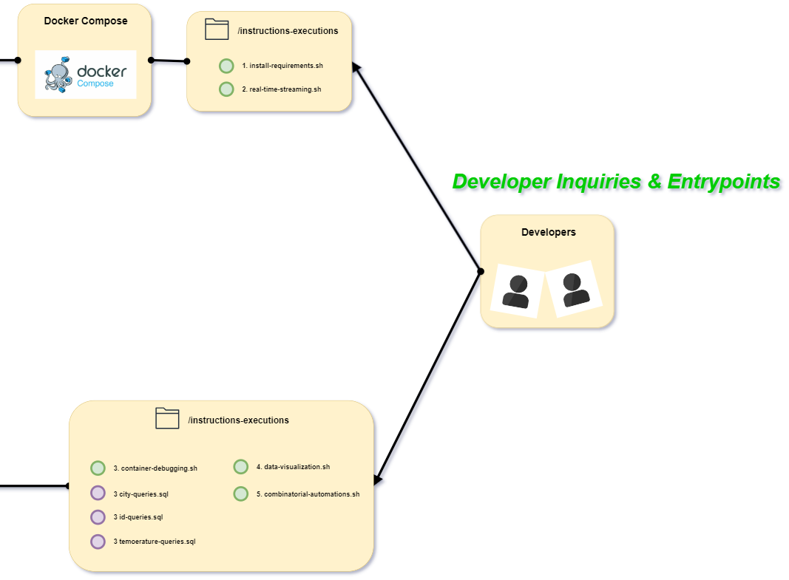
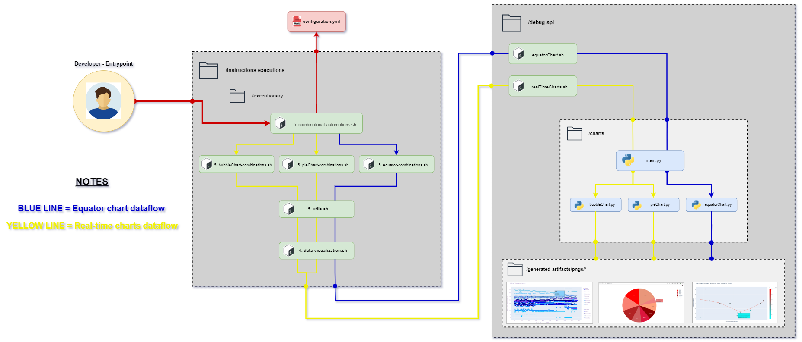
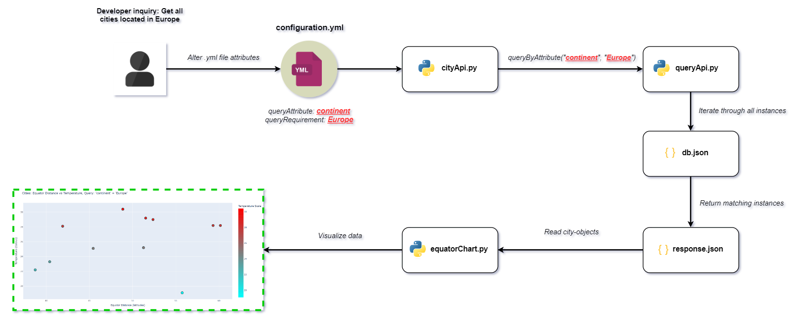

# 🏗️ Architecture Documentation V1

As mentioned in [Development Process](README-DEVELOPMENT-PROCESS.md), I developed this system throughout two intensive phases. The first one being in June 2024, and the second one in April 2025. This file describes the system's state as of June 2024, after my first development phase. If you wish to view the current architectural state, navigate to [Architecture V2](README-ARCHITECTURE-V2.md)

## Architecture

### Developer Endpoints

### Data Production

### Debug API

## Data Flow

### Shell Scripts

### Equator Chart Queries

#### Continent Query

#### Timezone Query

## Docker Volume

