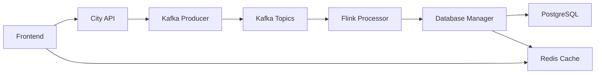
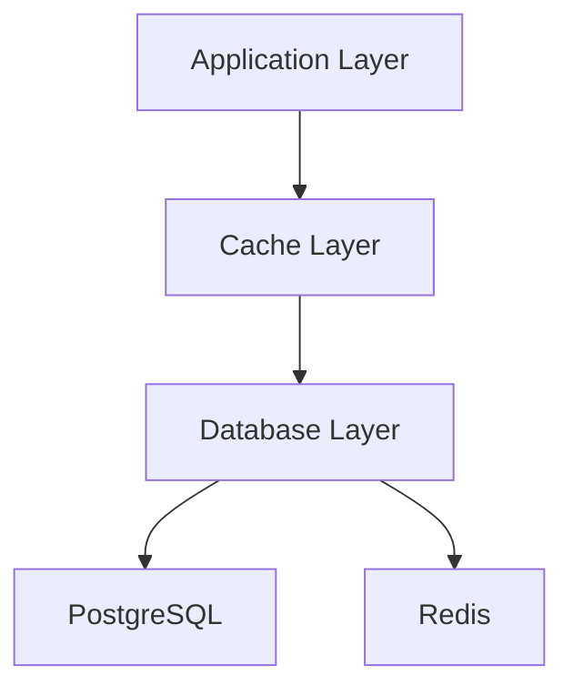

# 🏗️ Architecture Documentation

## System Overview
The Global City Streaming project is a distributed system that processes and visualizes real-time weather data from cities worldwide. The system is built using a microservices architecture with the following key components:

## Microservices Architecture

### 1. City API Service
- **Repository**: [city-api](https://github.com/joel0/city-api)
- **Purpose**: Manages city data and weather information
- **Technologies**: Spring Boot, Java
- **Key Features**:
  - Weather data fetching
  - City information management
  - RESTful API endpoints

### 2. Frontend Service
- **Repository**: [frontend](https://github.com/joel0/frontend)
- **Purpose**: User interface for data visualization
- **Technologies**: React, TypeScript
- **Features**:
  - Interactive maps
  - Real-time data display
  - Responsive design

### 3. Kafka Producer
- **Purpose**: Event streaming and data ingestion
- **Technologies**: Apache Kafka
- **Responsibilities**:
  - Weather data collection
  - Event publishing
  - Data transformation

### 4. Flink Processor
- **Purpose**: Stream processing and analytics
- **Technologies**: Apache Flink
- **Features**:
  - Real-time data processing
  - Complex event processing
  - Analytics computation

### 5. Database Manager
- **Repository**: [db-manager](https://github.com/joel0/db-manager)
- **Purpose**: Database operations and management
- **Technologies**: PostgreSQL, Redis
- **Features**:
  - Data persistence
  - Cache management
  - Query optimization

## Data Flow


## Component Interactions

### Data Collection Flow
1. City API fetches weather data
2. Kafka Producer ingests and publishes events
3. Flink processes streaming data
4. Database Manager stores processed results

### Data Retrieval Flow
1. Frontend requests data
2. Redis cache check
3. PostgreSQL fallback if cache miss
4. Real-time updates via WebSocket

## Infrastructure

### Containerization
- Docker containers for each service
- Docker Compose for local development
- Kubernetes for production deployment

### Database Architecture


### Monitoring & Logging
- Prometheus for metrics
- Grafana for visualization
- ELK Stack for log aggregation

## Security Architecture

### Authentication
- JWT-based authentication
- Role-based access control
- API key management

### Data Protection
- TLS encryption
- Data masking
- Regular security audits

## Scalability

### Horizontal Scaling
- Kubernetes auto-scaling
- Load balancing
- Service replication

### Performance Optimization
- Redis caching
- Database indexing
- Query optimization

## Development Environment

### Local Setup
```bash
# Clone repositories
git clone --recursive https://github.com/joel0/Global-City-Streaming.git
cd Global-City-Streaming

# Start services
docker-compose up -d
```

### Configuration Management
- Environment-specific configs
- Centralized configuration
- Secret management

## Future Architecture Considerations

### Planned Improvements
1. GraphQL API integration
2. Event sourcing implementation
3. Machine learning pipeline
4. Enhanced caching strategy

### Scalability Roadmap
1. Microservices mesh
2. Global distribution
3. Enhanced monitoring

For more information about:
- [API Documentation](./README-API.md)
- [Development Process](./README-DEVELOPMENT-PROCESS.md)
- [Charts Documentation](./README-CHARTS.md)