# 📊 Data Visualization & Charts

## Overview
The project implements three main types of charts:
1. Bubble Charts
2. Pie Charts
3. Equator Charts

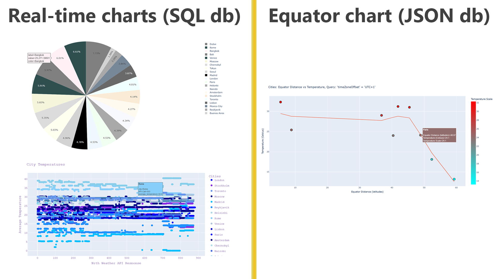

## Bubble Chart

### Evolution
1. First successful plot with matplotlib:
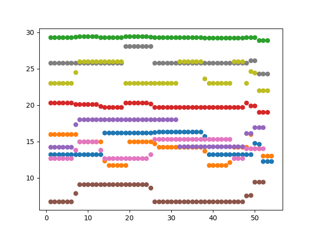

2. First Plotly implementation:
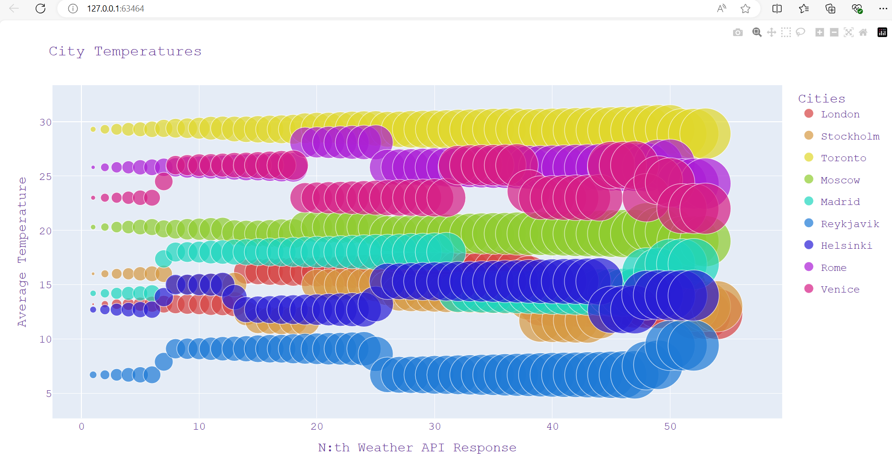

3. Color API integration with purple theme:
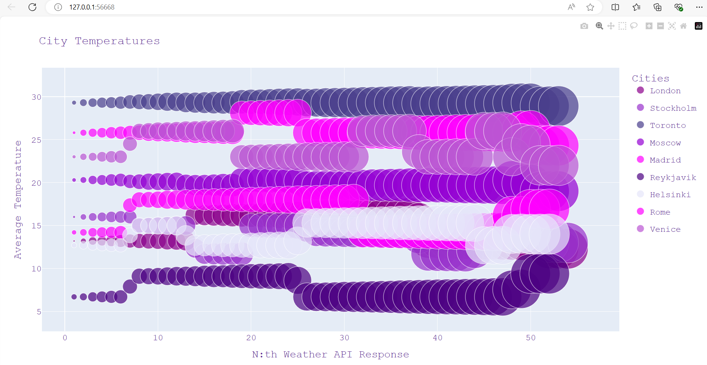

4. Single city analysis:

### Large Scale Visualization
With 20,000+ instances:

1. With outlines:
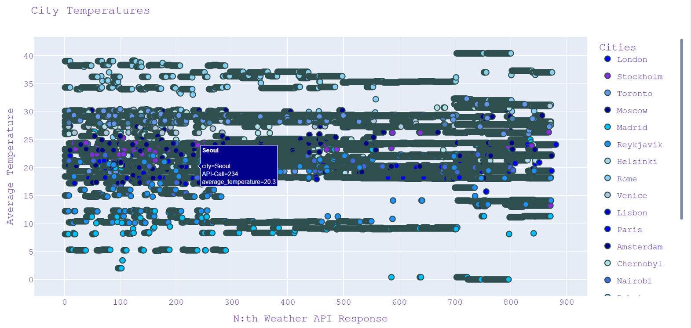

2. Without outlines (improved visibility):
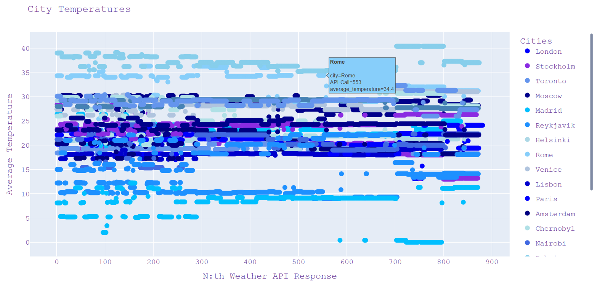

## Pie Chart

### Types

#### 1. Randomized Colors
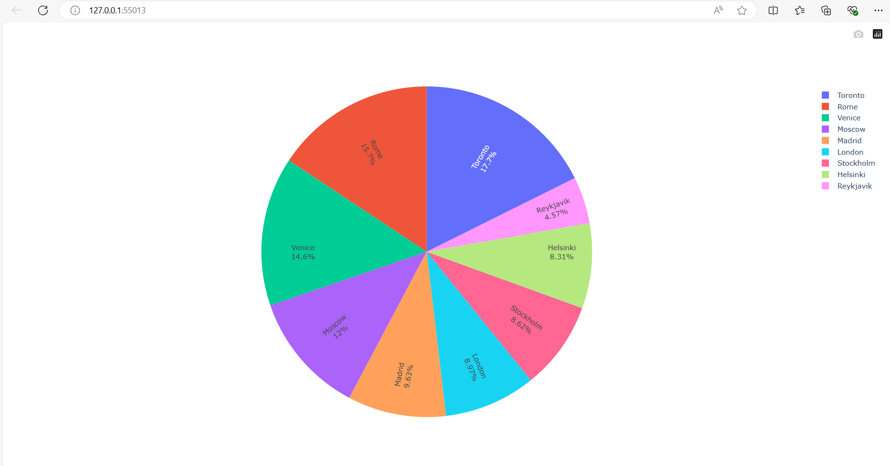
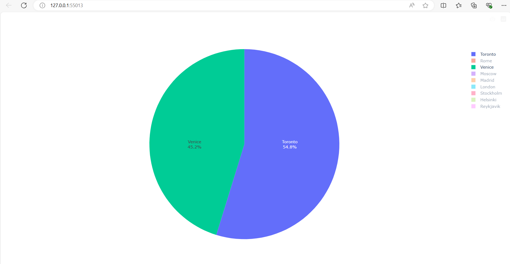

#### 2. 4 Coldest Cities
Displays proportional temperature differences:
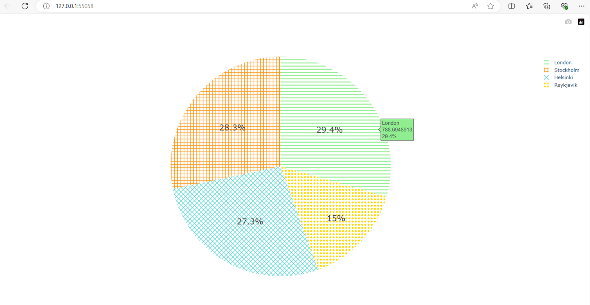

#### 3. Color Theme
Using Color API integration:

Red Theme:
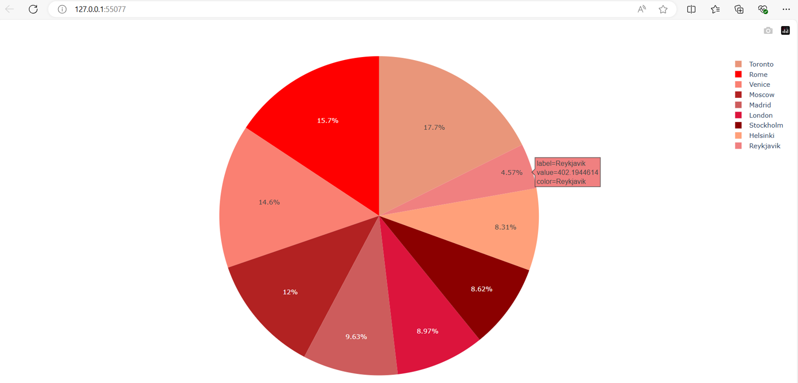

Brown Theme:
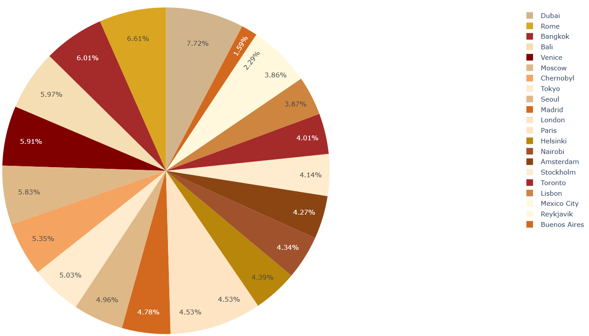

## Equator Chart

### Interactive Features

### Analysis Examples

#### Asia Analysis
Linear trend:
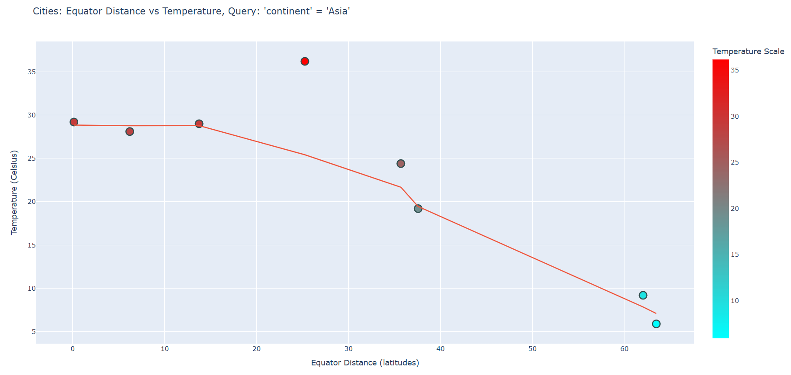

With logarithmic comparison:
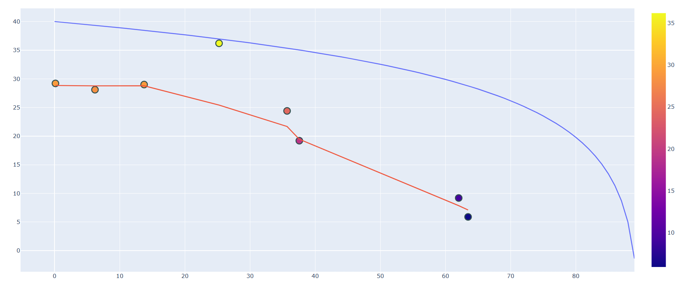

#### Europe Analysis
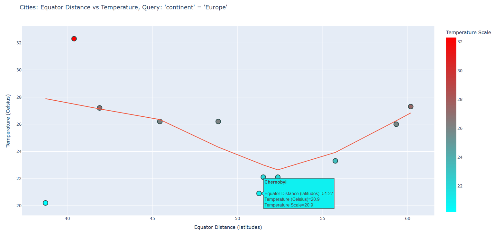

#### UTC+1 Analysis
Basic trend:
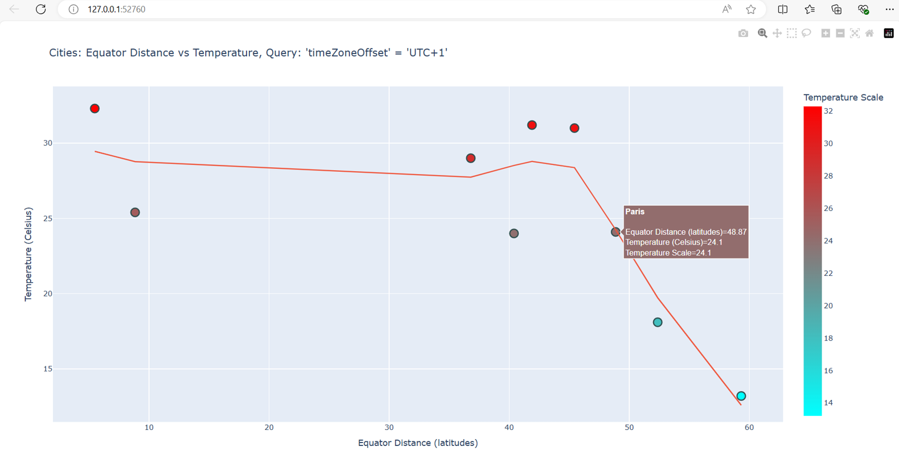

With logarithmic comparison:
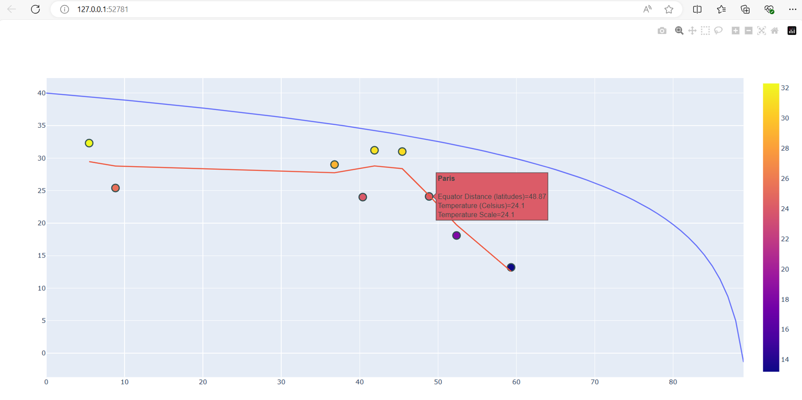

## Complexity Analysis

### Time Complexity
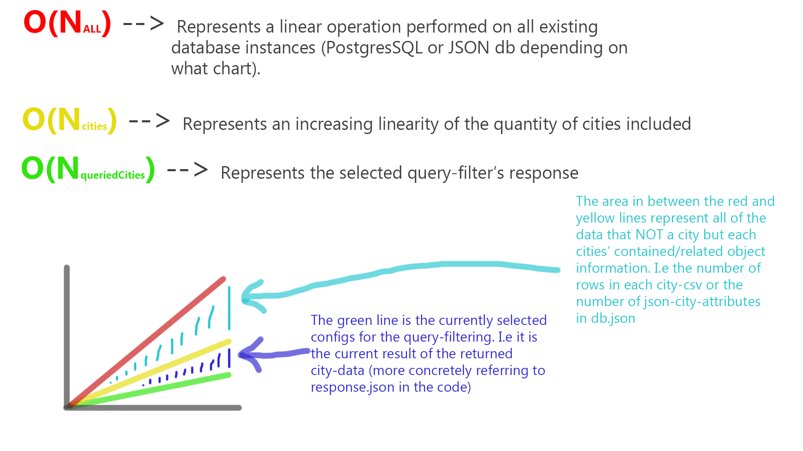

### Chart-Specific Complexities
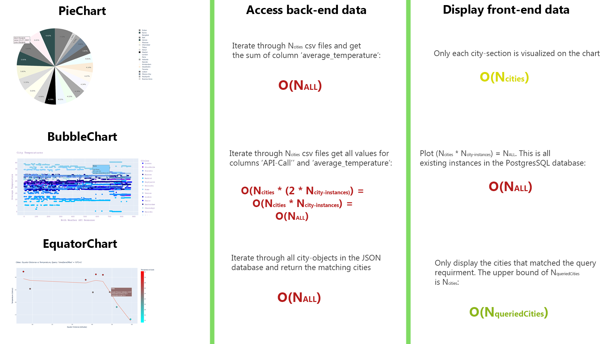

### Instance Calculation
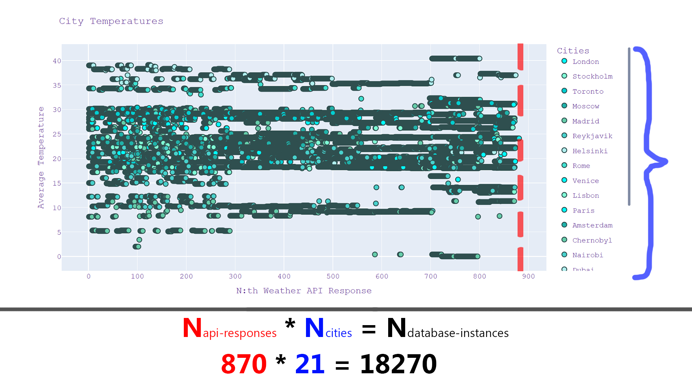

For more information about specific aspects:
- [Equator Analysis](./README-EQUATOR-ANALYSIS.md)
- [Development Process](./README-DEVELOPMENT-PROCESS.md) 