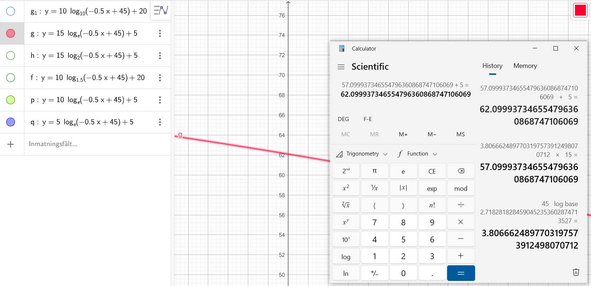
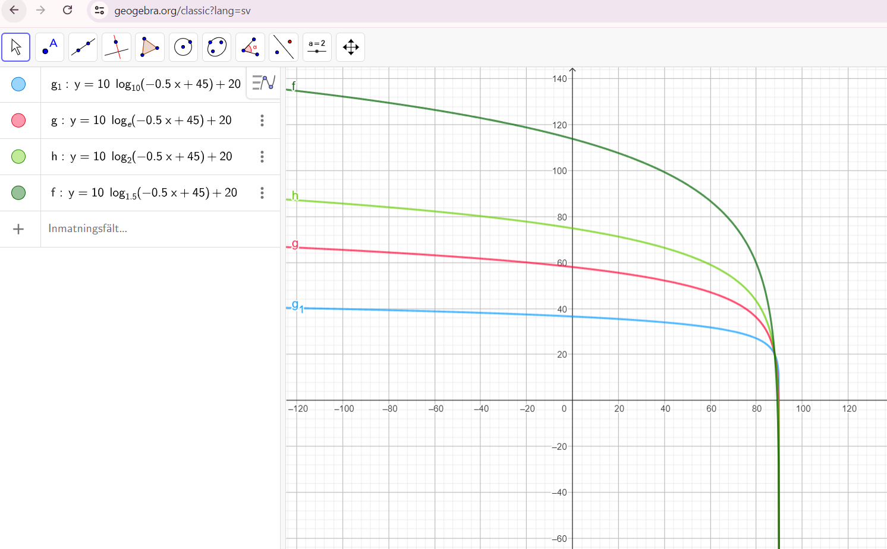
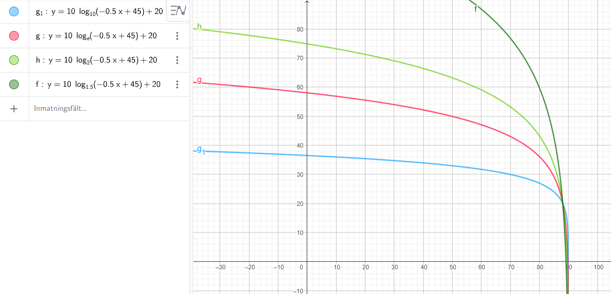
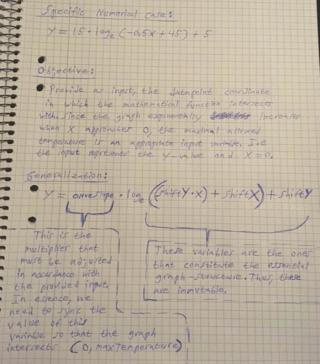
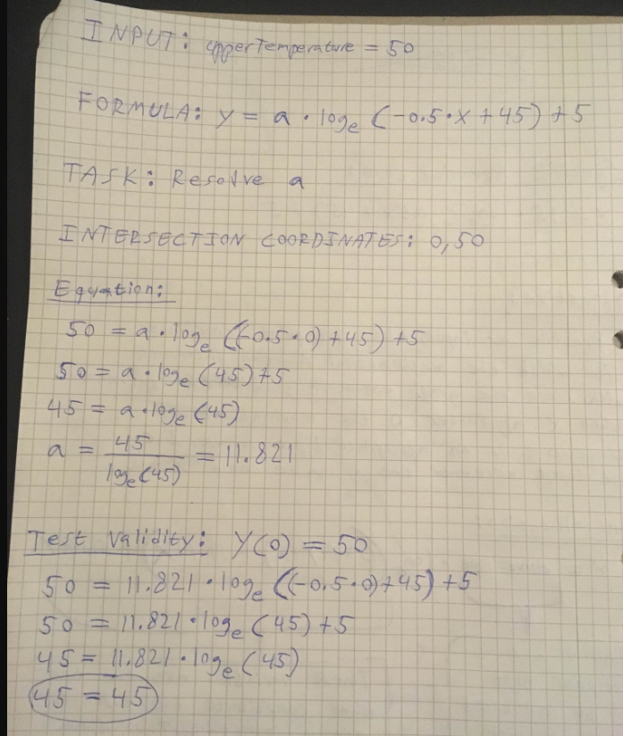
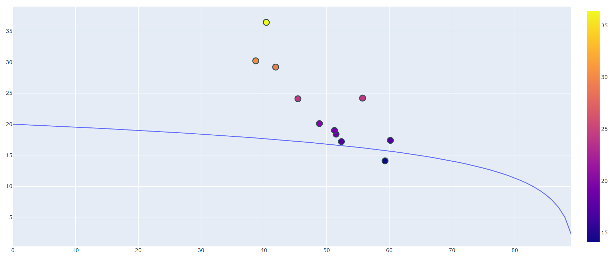
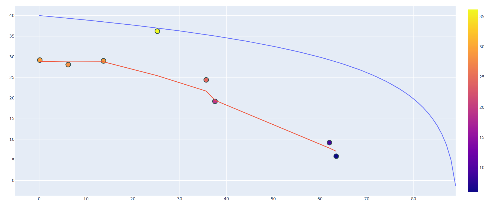
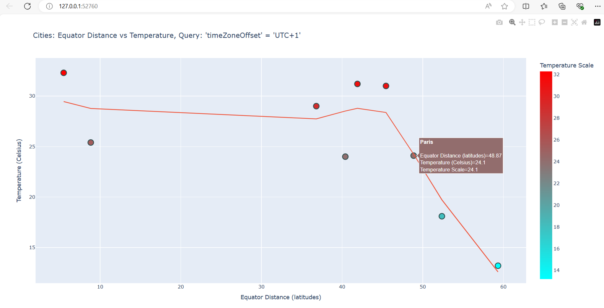
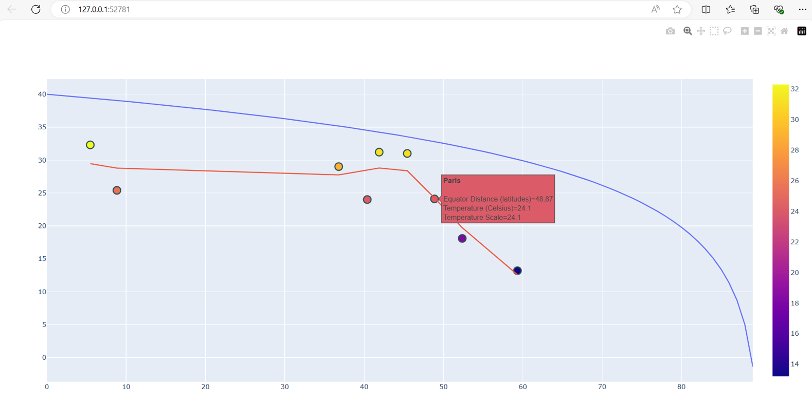

# 🌡 Equator Distance Temperature Analysis

## Hypothesis
> The closer to the equator a city is, the higher the average temperature is

In essence, this project explores and validates this hypothesis through data analysis and mathematical modeling. Below, the formula which I came up with for plotting a logarithmic trend for the expected temperature, making it adjustable to a fixed value as the maximal Y-value. I had a hypothesis that the closer to the equator that a geographical location is, the hotter the temperature generally is. But I didn't assume this trend to be linear, but rather have a similar curvature as typical skill acquisition or growth curves—in the sense that when an individual begins the pursuit of mastering a skill, they experience rapid and noticeable progress early on, but that apparent progress slows over time, and instead of improving 10% per week as they did initially, only a 0.1% improvement is actually achieved. Furthermore, in the context of that particular project, I intuitively made the assumption that cities closer to the north and south poles of Earth (the ones furthest away from the equator) are colder, but they aren't drastically colder. For instance, Sweden, which is close to the north pole, is undeniably colder than Spain, but the difference in temperature isn't of the expected magnitude. Hence, I concluded that a geographical location's distance to the equator (X) and its temperature (Y) shouldn't be expressed as a linear relationship

## Geographic Basis

Key concepts:
- Equator is at latitude 0°
- Total latitude range: -90° to 90°
- Distance to equator = absolute value of latitude

As a result, the mathemtical function to be derived should have the following properties:
- **X:** Ranges between 0 and 90
- **X=90:** The logarithmic function's value should equate to 0 (furthest distance from equator yields lowest temperature)
- **X=0:** The function should obtain its maximal value (cities at the equator should theoretically obtain the highest temperature)
- **Function Input:** Takes one input variable **yMax** (the highest city temperature or Y-value), such that the function **F(X)** always satisfies the conditions below:
  - **F(0) = yMax**
  - **F(90) = 0**
- **Function Curvature:** As the function peaks at *X=0*, it should then logarithmically decrease until it hits 0. This trend should be slowly decreasing in the beginning and gradually obtain a more intense declining slope. In other words, *as X increases, the declining slope rate also increases*

## Mathematical Analysis

### Theoretical Foundation
The relationship between temperature and equator distance follows a logarithmic pattern based on:

1. **Theoretical Reasoning:** Improvements are relative to prior state
2. **Mathematical Reasoning:** Return on investment decreases with progress
3. **General Real-World Application:** Follows standard deviation patterns

### Formula Development

#### Initial Analysis

#### Experimentation Phase
Series of tests in Geogebra to determine optimal formula:

1. X0 Value Calculation:

2. Formula Variants:

3. Logarithmic Base Testing:

4. Formula Elicitation:

#### M-Value Analysis

Experimental results:
1. 
2. 
3. 

Test marker validation:

### Final Formula
**y = 15 * loge(-0.5x + 45) + 5**

#### Paper Analysis
Original derivation:

Component breakdown:

Formula validation:

## Implementation Results

### Initial Testing
Single formula plot with highestCityTemperature = 50:

### Temperature Variable Testing
1. Max Temperature = 10°C:

2. Max Temperature = 20°C:

3. Max Temperature = 100°C (extreme test):

4. Final calibration at 40°C:

## Regional Analysis

### Asia
Linear trend analysis:

With logarithmic comparison:

### Europe
Unexpected pattern analysis:

### UTC+1 Zone
Basic trend:

With logarithmic validation:

## Interactive Visualization

For more information about related topics:
- [Charts Documentation](./README-CHARTS.md)
- [Development Process](./README-DEVELOPMENT-PROCESS.md) 
